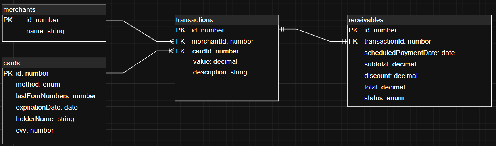

### Business logic

## 🗃️ Entity Relationship Diagram (ERD)

The system is designed to handle merchant transactions securely, track card usage, and generate receivables from completed transactions.

Below is a visual representation of the relationships between core entities:



### Rules

1. A **transaction** is made using **a single card**.
2. A **card** can be used for **multiple transactions**.
3. A **merchant** can have **many transactions**.
4. A **transaction** belongs to **only one merchant**.
5. A **transaction** can generate **only one receivable**.
6. A **receivable** is always linked to **exactly one transaction**.


### Decisions taken

- I'm following a layered architecture where I use Service, Repository, and Controller layers to clearly separate concerns and responsibilities.
- The basic API doc is covered with swagger to give a nice approach to the whole App
- Docker was used to make the app more reproducible and easier to deploy in cloud providers.
- Nest was chosen because it has a very nice approach to apply clean architecture out of the box by fostering dependency inversion principle with modules.
- Typescript was used because static type checks help a lot by preventing some bugs._
- A relational database was chosen instead of a NoSQL alternative because data integrity and ACID compliance are more critical for this system than raw performance. The ability to enforce constraints, transactions, and normalization guarantees a consistent state even in complex or concurrent operations.

#### Things that can be done to improve:
1. All the unit and integration test are skipped due lack of time, the critics endpoints of business logic are covered with e2e.
2. The service shouldn't implement http errors, a mapper should be included to translate domain errors into http responses.
3. The dockerized DB should include a volume to persist the data. 

## Routes

- API swagger: http://localhost:3000/api#/

## Pre-requisites

- Docker and docker compose installed.
- Linux/Mac terminal (Or emulated linux on Windows)
- No services running on localhost port 3000.

### Run APP with Docker

1. Execute script to run the app.

```
chmod 777 ./up_dev.sh
./up_dev.sh
```

### Run tests with Docker

Being at the same point before last step type:

```
chmod 777 ./up_test.sh
./up_test.sh
```

### Author

Santiago Pedrozo

- GitHub: https://github.com/santiagopedrozo
- LinkedIn: https://www.linkedin.com/feed/